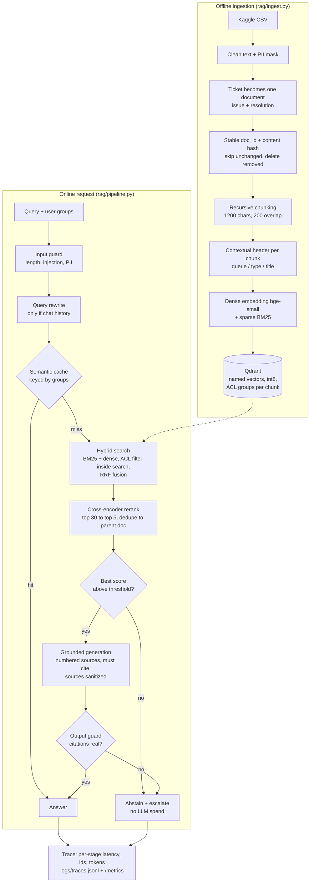

# rag-pipeline-project

Production-style RAG for an IT service desk assistant: hybrid retrieval, reranking,
permission-aware chunks, guardrails, deflection-first metrics. Every stage is measured, and CI blocks merges that make quality worse.

Data: about 16k resolved English IT support tickets from Kaggle
([tobiasbueck/multilingual-customer-support-tickets](https://www.kaggle.com/datasets/tobiasbueck/multilingual-customer-support-tickets), CC BY 4.0).

This repo is a working baseline. Several stages use cheap, deterministic methods on purpose
(regex guards, a fixed queue-to-group map, an in-memory cache). For each stage, the
"In production" column says what a real deployment would use instead and why.

## Results

145 golden questions over 16,641 chunks, run on a MacBook CPU with embedded Qdrant.

| Retrieval          | recall@1 | recall@5 | recall@10 | MRR   | p50 ms |
|--------------------|----------|----------|-----------|-------|--------|
| BM25               | 0.221    | 0.462    | 0.503     | 0.312 | 344    |
| Dense (bge-small)  | 0.172    | 0.510    | 0.566     | 0.311 | 112    |
| Hybrid (RRF)       | 0.228    | 0.497    | 0.586     | 0.337 | 424    |
| Hybrid + rerank    | 0.255    | 0.579    | 0.648     | 0.389 | 1520   |

- **Generation** (LLM judge, n=30): faithfulness 1.00, relevance 1.00, grounded 1.00, abstain 0.00.
- **ACL leak test:** 0 leaks across 24 restricted questions.

Reranking gives the biggest gain: +16% recall@5 over RRF fusion alone. It also costs the most
latency, because the cross-encoder runs on CPU. Recall is measured against the exact source
ticket. The dataset has many near-duplicate tickets, so a "miss" is often a different ticket
with the same fix.

## Pipeline



## Each step: how it works here, and how production does it better

### Offline ingestion

| Step | This repo | In production |
|---|---|---|
| **Load** | Read one Kaggle CSV with pandas. | Connectors for ServiceNow, Jira, Confluence, SharePoint and Slack, with webhooks or change-data-capture so updates land within minutes, not on a batch rerun. |
| **Clean** | Regex whitespace cleanup; drop rows under 30 chars. | Format-aware parsers (HTML, PDF, tables, email threads). Strip signatures, quoted replies and boilerplate. Detect language and route each language to the right model. |
| **PII masking** | Regex for email, card, phone and IP. | An NER-based PII detector (Microsoft Presidio, or an LLM classifier for names, addresses and employee IDs) that understands context, plus redaction audit logs. Regex misses names and over-matches numbers. |
| **Document unit** | One resolved ticket becomes one document. | Clustering and deduplication with embeddings or MinHash, so 50 near-identical tickets collapse into one canonical article. An LLM can summarise each cluster into a clean knowledge-base entry that names the fix. |
| **Incremental updates** | SHA-1 content hash per doc: re-embed only what changed, delete what was removed. | The same idea, driven by source events, plus versioned indexes. To change the embedding model, build a new index alongside the old one and switch an alias. |
| **Chunking** | Recursive split on paragraphs, then lines, then sentences: 1200 chars with 200 overlap. | Token-based sizes tuned on the eval set. Semantic or structure-aware chunking (headings, steps, tables). Parent-child chunks: small chunks for search, the full section sent to the LLM. |
| **Chunk context** | A fixed header `[queue / type] title` on every chunk. | Anthropic-style contextual retrieval: an LLM writes 1-2 sentences placing each chunk within its document. Prompt caching keeps this cheap. |
| **Access control** | A hand-written `QUEUE_ACL` map from queue to groups. | ACLs inherited per document from the source system, synced on change, and resolved against SSO and SCIM group membership. |
| **Embeddings** | Local bge-small (dense) and BM25 (sparse) via fastembed. | A larger or domain-fine-tuned embedder (contrastive training on query-ticket pairs from logs), plus multilingual models. Run on a GPU or a hosted embedding API. |
| **Vector store** | Embedded Qdrant on disk, with int8 quantization and payload indexes. | Qdrant, or a managed equivalent, as a cluster with replicas. Collections or tenant keys per customer, snapshots and backups. |

### Online request path

| Step | This repo | In production |
|---|---|---|
| **Identity** | `X-User-Groups` header. | Authenticated SSO token checked at the API gateway. The service never trusts groups the client sends. |
| **Input guard** | Regex for injection phrases, a length cap, regex PII masking. | A trained classifier or a small LLM judge for injection and jailbreaks (Llama Guard, Prompt Guard, a hosted moderation API). Regex is easy to bypass with paraphrases or other languages. |
| **Query rewrite** | An LLM call, only when chat history exists. | Also intent routing (question vs action such as "reset my password"), query expansion or HyDE for short queries, and filters extracted from the query (product, OS, date). A small, fast model handles it. |
| **Semantic cache** | In-process list with a cosine threshold of 0.95, keyed by sorted groups, 1h TTL. | Redis or a vector cache shared across replicas, with a cutoff tuned on labeled pairs. Invalidated when a cited document changes. Hit rate is tracked per tenant. |
| **Hybrid search** | Qdrant prefetches BM25 and dense results with the ACL filter applied during the search, then fuses them with RRF. | The same structure, plus metadata boosts (recency, resolution success, CSAT) and a learned ranking model (LightGBM on BM25 score, dense score, recency and click features) trained from user feedback. |
| **Rerank** | Local MiniLM cross-encoder on CPU (about 1.1s of the 1.5s p50). | A GPU or hosted reranker such as Cohere Rerank, bringing p50 under about 300 ms. Rerank only when the fused scores are close together. |
| **Abstain** | A fixed threshold on the top rerank score. | A threshold calibrated on the eval set per tenant, or a small classifier that predicts "answerable". Escalation opens a ticket with the retrieved context attached. |
| **Generation** | gpt-4.1 on Azure AI Foundry, temperature 0, numbered sources, required citations. Instruction-like lines are stripped from sources. | A model router (a small model for easy questions, a strong one for hard ones), streaming responses, and prompt caching for the system prompt. Structured output (JSON with `answer`, `citations`, `confidence`) instead of parsing text. |
| **Output guard** | Regex checks that every `[n]` citation exists and points at a real source. | Claim-level checks: an NLI model or LLM judge confirms each sentence is supported by its cited source. Output PII and toxicity filters. |
| **Observability** | JSONL traces (per-stage latency, retrieved ids, tokens) and Prometheus counters and histograms. | OpenTelemetry traces to Langfuse, Phoenix or Datadog. Dashboards for p50/p95 per stage, cost per answer and deflection rate. Alerts on drift. |
| **Feedback** | `/feedback` endpoint. | Explicit thumbs plus implicit signals (re-asks, escalations, ticket reopened) feeding the eval set and the learned ranker. |

## Evaluation

`eval/run_eval.py` scores each stage separately so a failure can be traced to one stage:

- **Retrieval:** recall@1/5/10, MRR and latency for BM25 vs dense vs hybrid vs hybrid+rerank.
- **Security:** ACL leak test (restricted questions asked by an unprivileged user).
- **Generation:** LLM-judge faithfulness and relevance, abstain rate, grounded rate.

CI (`.github/workflows/ci.yml`) runs the unit tests, rebuilds the index, runs the eval, and
fails the build if results drop below `eval/thresholds.json`.

**In production:**
- **Golden set:** build it from real labeled queries, not LLM-generated questions.
- **Judge:** calibrate the LLM judge against human labels.
- **Significance:** report bootstrap confidence intervals so small changes aren't mistaken for real ones.
- **Breakdowns:** slice results by queue and language.
- **Business metrics:** track deflection rate, CSAT and time to resolution.

## Run

```bash
cp .env.example .env            # fill Azure Foundry endpoint + key
make install data ingest        # about 15 min on CPU for the full index
make test                       # unit tests, no network
make golden eval                # LLM-generated golden set, then the eval gate
make serve                      # http://localhost:8000/docs

curl -s localhost:8000/ask -H 'content-type: application/json' \
  -H 'X-User-Groups: support' -d '{"query":"VPN keeps dropping on my Mac"}'
```

`docker compose up` runs the API against a Qdrant server instead of the embedded store.
`docs/rag-pipeline.html` is an interactive walkthrough of the pipeline.

## Layout

```
rag/
  ingest.py    load, clean, chunk, embed, upsert (incremental)
  store.py     Qdrant collection: dense + sparse named vectors
  models.py    local embedders, reranker, LLM client
  retrieve.py  ACL-filtered hybrid search, RRF, rerank, parent expansion
  generate.py  query rewrite, grounded answer with citations
  guard.py     PII masking, injection screening, citation check
  cache.py     permission-partitioned semantic cache
  pipeline.py  full request path with per-stage tracing and metrics
  api.py       FastAPI: /ask, /feedback, /metrics
eval/          golden set builder, staged eval, thresholds
tests/         fast unit tests (no models or network)
```

## Not included yet

- A multilingual index (the German tickets).
- Streaming responses.
- Auth middleware.
- Agent tool use (password reset, ticket creation).
- Learned ranking from feedback.
